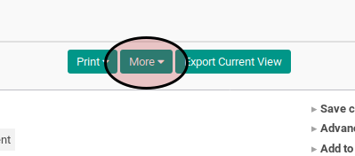
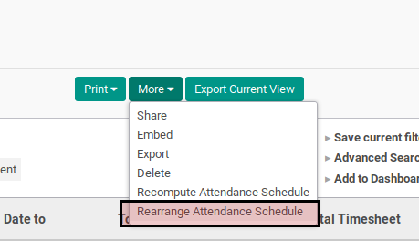

# Mengatur Ulang Attendance Schedule Beberapa Timesheet

## A. INPUT

* Data timesheet yang akan diatur ulang attendance schedule-nya harus memiliki status **Open**.

## B. INSTRUKSI KERJA

1. Klik menu **Human Resource -> Time Tracking -> Timesheets**. Abaikan jika sudah berada pada menu yang dimaksud.
2. Seleksi data timesheet yang akan diatur ulang attendance schedule-nya.
3. Klik tombol **More** pada bagian atas-tengah list timesheet.

4. Klik tombol **Rearrange Attendance Schedule** pada drop-down yang muncul pada tombol **More**. Calendar **Rearrange Attandance Schedule** akan terbuka.

5. Atur ulang attendance schedule dengan beberapa cara di bawah:
    1. Klik, Drag & Drop attandance schedule untuk memindahkan attendance schedule ke slot waktu lain.
    2. Resize attendance schedule untuk merubah durasi attendance schedule.
    3. Klik attendance schedule, ubah **Date Start** dan **Date End**. Klik tombol **Save** pada bagian bawah-kiri form.
