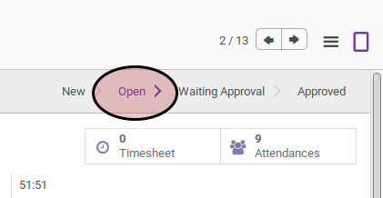

# Membuat Ulang Attendance Schedule

## A. INPUT

* Data timesheet yang akan dibuat ulang attendance schedulenya harus memiliki status **Open**.

## B. INSTRUKSI KERJA

1. Klik menu **Human Resource -> Time Tracking -> Timesheets**. Abaikan jika sudah berada pada menu yang dimaksud.
2. Buka data timesheet yang akan dibuat ulang attendance schedulenya. Abaikan jika data sudah dibuka.
3. Klik tombol **More** pada bagian atas-tengah form.

4. Klik tombol **Recompute Attendance Schedule** pada drop-down yang muncul pada tombol **More**

## C. OUTPUT

* Data attendance schedule akan dibuat ulang berdasarkan working schedule yang dimiliki oleh karyawan.
