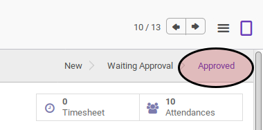
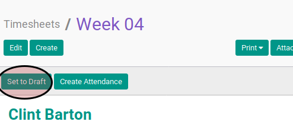

# Merestart Timesheet

## A. INPUT

* Data timesheet yang akan ditolak harus memiliki status **Approved**.

## B. INSTRUKSI KERJA

1. Klik menu **Human Resource -> Time Tracking -> Timesheets**. Abaikan jika sudah berada pada menu yang dimaksud.
2. Buka data timesheet yang akan ditolak. Abaikan jika data sudah dibuka.
3. Klik tombol **Set To Draft** pada bagian atas-kiri form.

## C. OUTPUT

* Data timesheet akan berubah menjadi **Open**.

